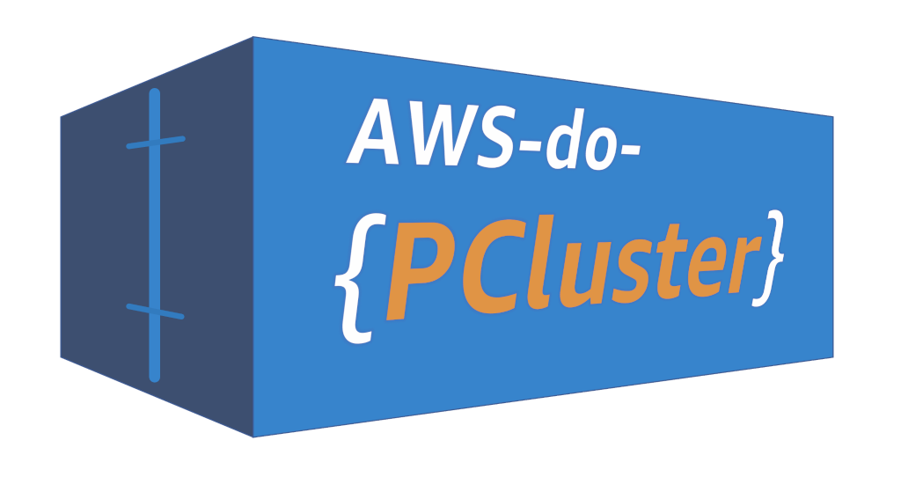

# AWS do PCluster (aws-do-pcluster) -  Create and Manage your AWS ParallelCluster infrastructure using the [do-framework](https://bit.ly/do-framework) 

## Overview
[AWS Parallel Cluster](https://aws.amazon.com/hpc/parallelcluster) is on open source cluster management tool for deployment and management of High Performance Computing (HPC) clusters on AWS. This project builds a container which contains all prerequisites, tools that are useful when working with Parallel Cluster, and the latest version of the `pcluster` cli. It comes with useful scripts to configure, create, and delete parallel cluster infrastructure. The goal of this project is to make use of Parallel Cluster easy by following the principles of the [do-framework](https://bit.ly/do-framework).

## Build

Execute `./build.sh` to build the `aws-do-pcluster` container image.

## Run

Execute `./run.sh` to start the `aws-do-pcluster` container.

## Status

The `./status.sh` script shows the current state of the `aws-do-pcluster` container.

## Exec

Run the `./exec.sh` script to open a shell in the `aws-do-pcluster` container. All tools, the `pcluster` cli, and utility scripts are available in the /pcluster directory.

### Utility scripts

* `ami-create.sh` - create an ami for the nodes of the parallel cluster 
* `ami-delete.sh <AMI_ID>` - deregister specified ami from account 
* `ami-dir.sh` - list local ami configurations that can be built with packer 
* `ami-list.sh` - list ami's owned by the current AWS account 
* `aws-config.sh` - configure aws client
* `keypair-create.sh [KEYPAIR_NAME]` - create ssh key pair with specified name
* `keypair-delete.sh [KAYPAIR_NAME]` - delete the specified key pair
* `keypair-list.sh` - list available ssh key pairs
* `pcluster-config.sh [CLUSTER_CONFIG] [-i]` - create a new parallelcluster configuration, `-i` invokes interactive wizard.
* `pcluster-create.sh [CLUSTER_NAME] [CLUSTER_CONFIG]` - create a parallelcluster using an existing configuration
* `pcluster-status.sh [CLUSTER_NAME]` - show creation status of a specified parallelcluster
* `pcluster-connect.sh [CLUSTER_NAME] [KEYFILE_PATH]` - ssh into the head node of the specified cluster using the specified private key
* `pcluster-list.sh` - list all parallelclusters in the current AWS account
* `pcluster-dir.sh` - show list of local parallelcluster configurations 
* `pcluster-update.sh [CLUSTER_NAME] [CLUSTER_CONFIG]` - update a parallelcluster using the specified configuration
* `pcluster-delete.sh [CLUSTER_NAME]` - delete the specified parallelcluster
* `stack-list.sh` - list paralellcluster related cloud formation stacks
* `stack-delete.sh <name>` - delete the specified cloudformation stack
* `vpc-list.sh` - list current VPCs in the region
* `vpc-subnets.sh <vpc_id>` - list subnets belonging to the specified vpc
* `vpc-delete.sh <vpc_id>` - delete the specified VPC 

## Stop

Execute the `./stop.sh` script to stop and remove the `aws-do-pcluster` container.

## Security

See [CONTRIBUTING](CONTRIBUTING.md#security-issue-notifications) for more information.

## License

This library is licensed under the MIT-0 License. See the LICENSE file.

## References
* [Docker](https://docker.com)
* [do-framework](https://bit.ly/do-framework)
* [AWS ParallelCluster](https://aws.amazon.com/hpc/parallelcluster/)
* [AWS ParallelCluster Documentation](https://docs.aws.amazon.com/parallelcluster/index.html)

